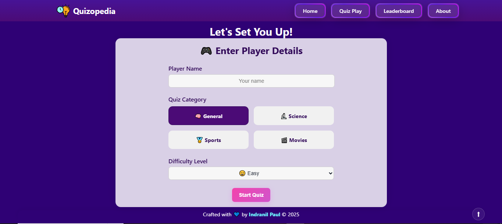
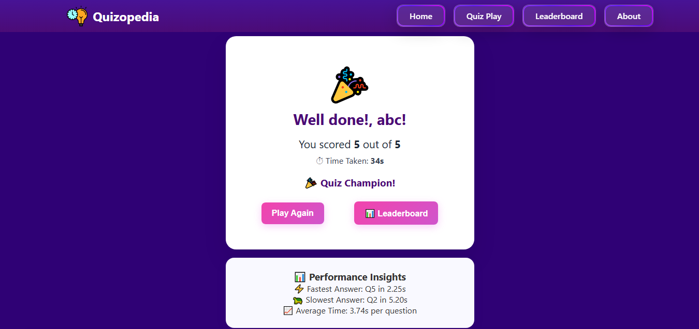

# 🧠 Quizopedia

> An interactive and fully responsive quiz application built with React, Vite, and modern CSS — offering a seamless and engaging user experience with score tracking, leaderboard, and performance analytics.


---

## 🚀 Live Demo

👉 [Visit Quizopedia](https://quizo-pedia.netlify.app/)

---

## ✨ Features

- 🎮 Choose from categories like General Knowledge, Science, Sports, and Movies
- 📊 Real-time score tracking and leaderboard with sorting options
- ⏱ Per-question timer and detailed performance analysis
- 📈 Post-quiz insights: fastest/slowest answer, average time
- ❌ Mistake review with correct answers
- 🔁 "Play Again" and instant replay options
- 📱 Fully responsive and mobile-friendly design
- 💾 Uses localStorage to persist leaderboard and quiz history
- 📷 Share score via screenshot download

---

## 🛠 Tech Stack

- ⚛️ React.js + Vite
- 🧭 React Router (HashRouter)
- 🎨 Tailored CSS & Glassmorphism styling
- 💾 localStorage for persistence
- 🎯 JavaScript for logic & timer
- 📦 GitHub Pages for deployment

---

## 📂 Project Structure

```
quizopedia/
├── public/
│   ├── assets/
├── src/
│   ├── components/
│   │   ├── Navbar.jsx
│   │   ├── QuizEngine.jsx
│   │   ├── AddPlayerForm.jsx
│   │   ├── Carousel.jsx
│   │   └── Footer.jsx
│   ├── pages/
│   │   ├── Home.jsx
│   │   ├── Quiz.jsx
│   │   ├── Scores.jsx
│   │   ├── About.jsx
│   │   └── ScoreSummary.jsx
│   ├── data/
│   │   └── questions.js
│   ├── App.jsx
│   ├── main.jsx
│   └── index.css
├── vite.config.js
├── package.json
└── README.md
```

---

## 📊 Quiz Flow

1. 👤 Enter player name, choose category and difficulty
2. ⏱ Quiz starts (15 seconds/question)
3. ✅ Each answer is timed and validated
4. 🎯 At the end:
   - Total Score
   - Time Taken
   - Average Response Time
   - Fastest & Slowest Questions
   - Mistake Review
5. 🔁 Option to replay or view leaderboard

---

## 🧪 Available Categories

- 📘 General Knowledge  
- 🔬 Science  
- 🏏 Sports  
- 🎬 Movies

Each has:
- 🟢 5 Easy Questions  
- 🟡 5 Medium Questions  
- 🔴 5 Hard Questions  

---

## 📸 Screenshots

| Home Page                          | Quiz Page                            | Score Summary + Review                |
|-----------------------------------|--------------------------------------|---------------------------------------|
|  |  |        |

 
---

## ⚙️ Local Development

1️⃣ **Install dependencies**

```bash
npm install
```

2️⃣ **Start development server**

```bash
npm run dev
```

3️⃣ **Build for production**

```bash
npm run build
```

---

## 🙋‍♂️ Author

Made with ❤️ by **Indranil Paul**  
📫 [LinkedIn](https://www.linkedin.com/in/indranil-paul-470a13271/) |  [GitHub](https://github.com/indranilpaul15)

---

## 🤝 Contributing

Contributions, suggestions, and new question sets are welcome!  
Feel free to fork this project and open a pull request.
